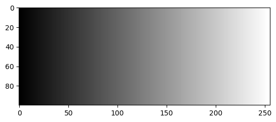
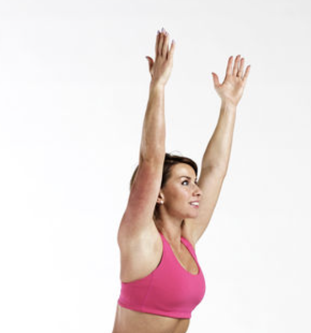

# Pose Detection with MediaPipe and OpenCV: Beginner's Guide

## Table of Contents
### 1: [Introduction](#1)
### 2: [Installation](#2)
 - 2.1: [Download Python](#2.1)
 - 2.2: [Creating a Virtual Environment](#2.2)
 - 2.3: [Install Python Libraries](#2.3)
### 3: [OpenCV Tutorial](#3)
 - 3.1: [OpenCV Basic Features](#3.1)
 - 3.2: [OpenCV Basic Implementations](#3.2)
### 4: [MediaPipe -- Pose Detection Demonstrations](#4)
 - 4.1: [Pose Detection Library Features](#4.1)


<h2 id='1'>1: Introduction</h2>

Welcome to the beginner's guide to Computer Vision and Mediapipe! # what should I put here?? 

<h2 id='2'>2: Installation</h2>

Ensure you have the following libraries installed before starting:

<h3 id='2.1'>2.1: Download Python (version 3.7 - 3.11)</h3>

-   By the time of the setting of this document, openCV supports python version from 3.7 to 3.11. 
-   If you don't have a compatable python version or haven't downloaded any version of python, you can [Download here](https://www.python.org/downloads/) by choosing the correct version. 

<h3 id='2.2'> 2.2: Creating a Virtual Environment</h3>

-   A Python virtual environment (venv) is a self-contained directory that allows you to install packages and dependencies for a specific project without affecting the global Python installation or other projects.

1. Open a terminal in vscode and type `cd Computer\ Vision` to enter the correct directory
2. Create a venv:
    - Enter `python -m venv name-of-your-venv` in the same terminal. 
    Now you should see a folder with your venv's name appeared under the "Computer Vision" directory
3. Activate the venv:
    - for Mac/Linux users: `source ./name-of-your-venv/bin/activate `
    - for Windows users: `.\venv\Scripts\activate.bat`
    - you should now see `(name-of-your-venv)` being appended to your input prompt, indicating that you have activated your venv

<h3 id='2.3'>2.3: Install Python Libraries</h3>


-   **OpenCV**: For handling image and video processing.
-   **MediaPipe Solutions**: For real-time computer vision tasks such as pose estimation, hand tracking, and face detection. 
-   **Numpy**: For matrix and array operations.

you can download the above 3 python libraries in your virtual environment by entering this one-line command:
    ```
    pip install opencv-python mediapipe numpy
    ```
<h2 id='3'>3: OpenCV Tutorials</h2>

<h3 id='3.1'>3.1: Basic OpenCV Features</h3>

Here are some important concepts and features of OpenCV that beginners should know:

**Image Chanels**
- **Grayscale images** have 1 channel that represents the intensity level
    - 
    - the smaller the number is, the darker the pixel
- **Colour images** have 3 channels (Red, Green, Blue)
    - 

**BGR vs RGB Color Format**
- OpenCV processes images in **BGR** format, not the typical **RGB** format used in other image processing libraries. The difference is in the order of the color channels
- This means that when OpenCV reads an image, the pixel values will be ordered as BGR. If you need to convert from BGR to RGB, you can do so like this:
    ```
    # Convert BGR image to RGB
    rgb_image = cv2.cvtColor(image, cv2.COLOR_BGR2RGB)
    ```
**Working with Arrays**
- OpenCV images are stored as **NumPy arrays**. This means you can use NumPy's powerful indexing and slicing features to manipulate image data directly:
    ```
    # Access the pixel at row 50, column 100
    pixel = image[50, 100]

    # Modify the pixel value (in BGR format)
    image[50, 100] = [255, 0, 0]  # Set to blue
    ```
<h3 id='3.2'>3.2: OpenCV Basic Implementations</h3>


**[Reading and Displaying an Imagage](cv_exmaples/read_show_image.py)** (These titles are clickable)

 - Using the [```cv2.imread()```](https://www.geeksforgeeks.org/python-opencv-cv2-imread-method/) and [```cv2.imshow()```](https://www.geeksforgeeks.org/python-opencv-cv2-imshow-method/) method.
 - Your first place to start! Now you can display an image from file with openCV!

**[Converting Image to Grayscale](cv_exmaples/convert_to_grayscale.py)**
 - Using the [```cv2.cvtColor()```](https://www.geeksforgeeks.org/python-opencv-cv2-cvtcolor-method/) method to convert a bgr coloured image to grayscale.
 - Since grayscale images have only one colour channel, its file size is much smaller than coloured images. This is a great option when you want to optimize the computation efficiency of an image/video where you don't need the colour information. 

**[Resize Image](cv_exmaples/resize_image.py)**
 - Using the [```cv2.resize()```](https://www.geeksforgeeks.org/image-resizing-using-opencv-python/) method.

**[Capture Video from Webcam](cv_exmaples/capture_from_webcam.py)**
 - Use the [```cv2.VideoCapture()```](https://www.geeksforgeeks.org/python-opencv-capture-video-from-camera/) method with parameter 0 to open the built-in webcam of your laptop
 - Call the ```read()``` method on the VideoCapture object in a loop too process it frame by frame

 **[Read Video from File](cv_exmaples/read_video_from_file.py)**
 - Same as the above, but replace the parameter in the ```VideoCapture()``` method with the path to the file.

**[Edge Detection](cv_exmaples/detect_edge.py)**
 - Edge dection highlights boundaries within an image where there is a sharp change in brightness. This is used in various applications such as object recognition, image segmentation, motion detection, etc.
 - This code demostrate the most popular edge detection algorithm, the Canny algorithm with the [```cv2.Canny()```](https://docs.opencv.org/4.x/da/d22/tutorial_py_canny.html) method. 

**For more tutorials, checkout the [official OpenCv-Python Tutorials page](https://docs.opencv.org/4.x/d6/d00/tutorial_py_root.html)**

<h2 id='4'>4: MediaPipe -- Pose Detection Demonstrations</h2>

 - Mediapipe provides libaries for a great variety of tasks that you can choose from depending on the goal of your project. You can find a web-based demo of these library utilities on the [MediaPipe Studio site](https://mediapipe-studio.webapps.google.com/demo/pose_landmarker).

    - Use your webcam as the input and tweek the parameter values to have some fun with it!

 - This guide will only go over the basics of the **Pose Detection** library as it may be the most relavent to your problem space.

 <h3 id='4.1'>4.1: Library Features</h3>

 - The Mediapipe Pose Detection library tracks the location of 33 body landmarks.
    - 

 - Each landmark contains the x, y, z coordinate and the visibility of the landmark
    ```bash
        # print an example landmark

        x: 0.401668698
        y: 0.664962471
        z: -0.16625689
        visibility: 0.998352528
    ```
    - ```x``` and ```y``` are normalized coordinates representing the 2D position of the landmark in the image 
        - Ranging from 0 to 1, relative to the image dimensions.
    - ```z``` is a **relative** depth coordinate representing the distance of the landmark from the camera.
        - We obiviously are not working with depth camera here, so the ```z``` value is not a real "measured" value. It is rather estimated by the Mediapipe model. 
    - ```visibility``` is a confidence score indicating how likely it is that the landmark is visible or correctly detected. 
        - Ranges from 0.0 to 1.0. 
            - 1.0 == high confidence
            - 0.0 == low confidence
    - Let's say if the program can only view the upper body of a person to detect their pose, like this:

        \
    the pose detection method will still, by default, return the ```x y z``` coordiante of the lower body landmarks.
        - The visible upper body landmarks will have very ```high``` ```visibility``` values
        - the knee joints and ankle joint will have extremely ```low``` ```visibility``` value.
        - the hip joints will have ```median``` ```visibility```value because the model can estimate the hip joint coordinates with a higher confidence based on the visible upper body landmarks.

 <h3 id='4.2'>4.2: Library Basic Implementations</h3>

**[Pose Detection on an Image](mp_examples/draw_landmarks_on_image.py)**
 - Visit this code snippet for the simplest implementation that detects and draws the landmarks on an image. 
 - Think about how to:
    1. Get the ```x y z``` coordinates and the ```visibility``` value of a specific landmark?
    2. Change the colour and thickness of the landmark labels and the connection lines?
    3. ❗Calculate the angle at the left elbow joint?

**[Pose Detection on LiveStream](mp_examples/draw_landmarks_on_live_stream.py)**
 - Now that you know how to process on one image, processing a video or livestream is easy, since a video is just numerous frames of an image. 
 - Check out this code on how that is done, then, you are ready to start your own journey of using CV and Mediapipe to accomplete your own project!

 --- 

 Good Luck! 
