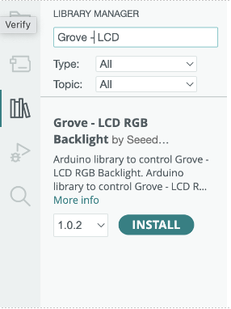
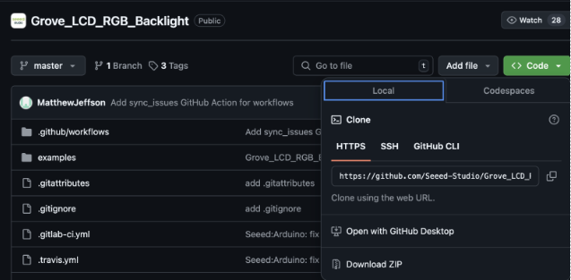
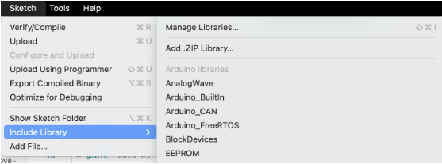
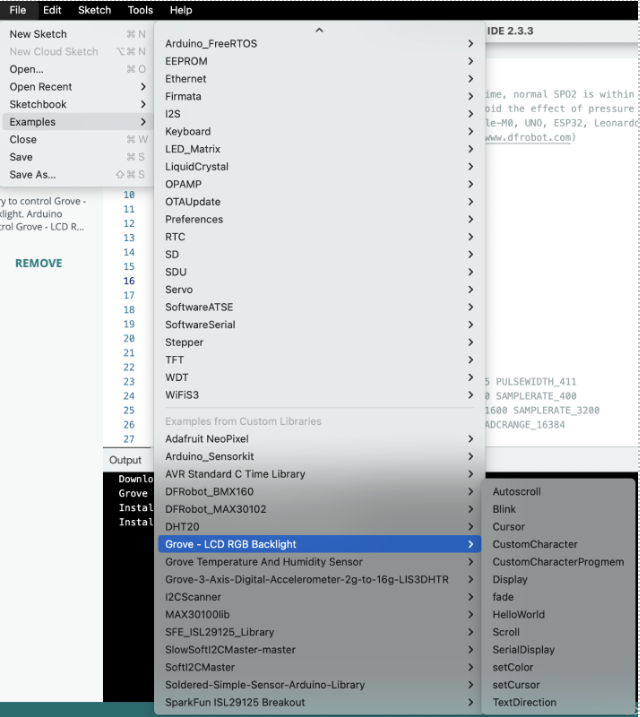
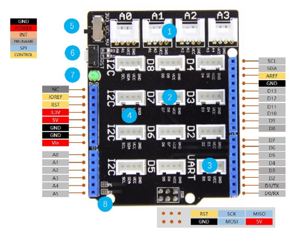
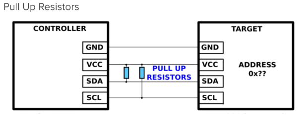

# Sensor Start-Up Guide
A step-by-step guide on how to  implement arduino sensor modules into python workspaces.

### Contents:
1. [Arduino IDE Setup](#1-arduino-ide-setup)
    * [Arduino Board And Port Setup](#arduino-board-and-port-setup)
    * [Intalling Libraries](#installing-libraries)
2. [Communicating with the Arduino](#2-communicating-with-the-arduino)
3. [Arduino Shield Connections](#3-arduino-shield-connections)
4. [Sensor Set-Up](#4-sensor-setup)
    * [Accelerometer](#accelerometer)
    * [Button/Touch Sensor](#buttontouch-sensor)
    * [Buzzer](#buzzer)
    * [Color Sensor](#color-sensor)
    * [LCD Display](#lcd-display)
    * [LEDs](#leds)
    * [Pulse Oximeter](#pulse-oximeter)
    * [Servo](#servo)
    * [Sound Sensor](#sound-sensor)
    * [Temperature Sensor](#temperature-sensor)
5. [Useful Functions](#5-useful-functions)
6. [Common Problems](#6-common-problems)


## 1. Arduino IDE Setup

### Arduino Board and Port Setup
If you do not already have the Arduino IDE, you can download it [here](https://www.arduino.cc/en/software). We recommend downloading the first option - Arduino IDE 2.3.4.
Before you can begin coding, you should configure your Arduino IDE to the specific arduino you are using. In this case you will be using the "Arduino UNO R4 Minima".

1. Go to the bar at the top of the screen that reads "Select Board". 
2. Select the option "Select other board and port".
3. Search the board name "Arduino UNO R4 Minima", then select it.
4. Select the port which the arduino is connected to from the drop-down menu, then click "ok".<br>
**If the port you are using is not shown, select "show all ports".<br>
**If you don't know the port ID, go to your "Device Manager" to find the ID under "Ports".

### Installing Libraries
The required libraries for each sensor are listed in [Sensor Setup](#4-sensor-setup), use this [Link](https://docs.arduino.cc/software/ide-v1/tutorials/installing-libraries/) for more help installing libraries.
#### Method 1: Using the Arduino R4
Search for the Library name in the ‘library manager” in the Arduino IDE and install. <br>

#### Method 2: Downloading Library Zip File
##### Steps:
1. Download the library from GitHub as a .zip file <br>


2. Once downloaded simply browse to the Arduino IDE and add the library as a zip file. 
<br>(Sketch -> Include Library -> Add .ZIP Library) <br>

3. Browse to File -> Examples and then find your library and click on the example to get some example code for how to use that library. <br> 


### Running Code
To upload the code to the Arduino, ensure that the correct port is selected, and press the button with the arrow in the top left. This will send the code to the Arduino and it will loop forever. If you want to restart your code, you can click the reset button (labeled RST on the shield next to the green light) once. If you want to erase the code from the Arduino without uploading new code, you can click this reset button twice. If you ever find that the code is failing to upload despite the correct port being selected, it is generally a good idea to try erasing the old code.


## 2. Communicating with the Arduino
All communication is done via the Serial port. You can view the serial port using your Arduino IDE by going to tools -> serial monitor from the menu at the top. You can also open it up as a graph view by opening the serial plotter in the same menu. Whenever there is a Serial.print() or Serial.println() command in the Arduino code, that information should show up in your serial monitor. 

#### Baud Rate
Any test code that uses the serial port runs a setup function to initialize the code settings. Serial.begin() initializes the Serial Monitor baud rate. Whatever number is initialized in the Setup() function must match the baud rate value in the Serial Monitor. Most of the time, your IDE will change it automatically, but it is important to check if things are not working. 

#### Arduino Code
* As well, the Arduino can read and respond to information sent to it from the serial port. 
* [Code to respond to serial inputs wrapped with <>, ex. < message >](https://github.com/IdeasClinicUWaterloo/InnovationChallange_Guides/blob/main/Dashboard/Arduino_Code/Serial_Communication/SerialReader/SerialReader.ino)

#### Python Code
* Python can also send and recieve messages through the serial port using the [PySerial](https://pyserial.readthedocs.io/en/latest/) library
* To install this library, follow steps 2.1 and 2.2 [here](https://github.com/IdeasClinicUWaterloo/InnovationChallange_Guides/blob/main/Computer_Vision/GUIDE.md#21-download-python-version-37---312), and then run ```pip install pyserial```
* [Python code to communicate with Arduino](Arduino_Code/Part_Testing/ArduinoToPython.py?ref_type=heads), to be used with an Arduino running the code above
* You will likely need to close the serial monitor in your Arduino IDE in order to run this code


## 3. Arduino Shield Connections
The Grove Base Shield V2 is an Arduino compatible board with Grove ports. This component fits directly on top of the Arduino UNO ports allowing for connections to be easily made to grove seeeduino modules (sensors) and multiple I2C connections. 
1. 4 Analog Ports: A0, A1, A2 and A3. 
2. 7 Digital Ports: D2, D3, D4, D5, D6, D7 and D8. 
3. 1 UART Port: UART. 
4. I2C Ports: 4 I2C ports. 
5. Power Switch: when using Arduino UNO with Base Shield v2, **please turn the switch to 5v position.** This voltage is required for the shield to function, and is not meant to be changed at any point. If you need 3.3v for an external device, use the 3.3v port on the right side of the board in the blue rails.
6. Reset Buton: reset the arduino board. 
7. PWR LED: The Green LED turns on when power on. 

Each of the white connection ports is labelled with that port’s required connections. Each white port should only be connected to one sensor/module.  

The blue connection ports on the sides of the shield are directly above the ports they connect to on the Arduino. Please note that the white connection ports with the same name as a blue connection port are connected. This means if you have one sensor in the white D7 and another in the blue D7, they will interfere.

When connecting modules to the arduino, ensure wires are connected to the correct locations such that GND on the sensor goes to GND on the shield, VCC to VCC, SDA to SDA, and so on. 

For analog and digital pins, there are 4 connection points but only 3 are needed. The pin number that is printed on the shield next to the port is the connection that should be used for data transmission. <br>  




## 4. Sensor Setup

Use the resources under each sensor type to learn more about how the sensor works, what libraries are needed, and how to connect it to your arduino.
For the test codes provided for each sensor, open a blank Arduino IDE tab to copy and paste to code into.

***
### **Accelerometer**
[Part Link](https://www.digikey.ca/en/products/detail/dfrobot/SEN0373/13590881?s=N4IgTCBcDaIMoFEByAGAzAdjSAugXyA)
* #### Libraries
   * [DFRobot_BMX160 ](https://github.com/DFRobot/DFRobot_BMX160)
* #### Documents
   * [Datasheet + Setup Guide](https://wiki.dfrobot.com/BMX160_9_Axis_Sensor_Module_SKU_SEN0373)
* #### Hookup
   * The accelerometer uses an I2C port on the Base Shield which requires a VCC, GND, SCL, and SDA connection. Each pin should be connected to the corresponding pin of the same name on the Base Shield, with the other pins on the sensor left disconnected.<br><br>
   * Use Breadboard to attach wires from the respected sensor pin to the Base Shield. 
* #### Code
   * Run the following code to output the accelerometer x, y, and z acceleration values to the serial monitor. When laid flat on the table, the z-axis should read ~-9.81m/s2 and the other two values should read ~0. Example code provided by the library can also be used for further understanding of the accelerometer functions. 
   * [Accelerometer Test Code](Arduino_Code/Part_Testing/Accelerometer_test/Accelerometer_test.ino?ref_type=heads)


***
### **Button/Touch Sensor**
* [Button Part Link](https://wiki.seeedstudio.com/Grove-Button/)
* [Touch Sensor Part Link](https://wiki.seeedstudio.com/Grove-Touch_Sensor/)
* #### Libraries
   * No additional libraries needed for these sensors.
* #### Docuents
   * [Button Manual](https://robu.in/wp-content/uploads/2019/09/Grove-Button-User-Manual.pdf)
   * [Touch Sensor Manual](https://robu.in/wp-content/uploads/2019/09/Grove-Touch-Sensor.pdf)
* #### Hookup
   * Using one of the digital ports (D7) on the Base Shield, simply use the provided 4-prong connection wires to directly connect the sensor to the Base Shield, ensuring proper connections are made (GND to GND, VCC to VCC, etc.)
* #### Code
   * [Button/Touch Test Code](Arduino_Code/Part_Testing/ButtonAndTouchSensor_test/ButtonAndTouchSensor_test.ino?ref_type=heads)


***
### **Buzzer**
* [Part Link](https://wiki.seeedstudio.com/Grove-Buzzer/)
* #### Libraries
   * [Servo](https://docs.arduino.cc/libraries/servo/) - Also available in Ardiuno IDE Library Manger
* #### Docuents
   * [Manual](https://www.mouser.com/datasheet/2/744/Seeed_107020000-1217511.pdf)
* #### Hookup
   * Using one of the digital ports (D8) on the Base Shield, simply use the provided 4-prong connection wires to directly connect the sensor to the Base Shield, ensuring proper connections are made (GND to GND, VCC to VCC, etc.)
* #### Code
   * [Buzzer Test Code](Arduino_Code/Part_Testing/Buzzer_test/Buzzer_test.ino?ref_type=heads)


***
### **Color Sensor**
* [Part Link](https://www.digikey.ca/en/products/detail/dfrobot/SEN0101/6588457?gclsrc=aw.ds&&utm_adgroup=&utm_source=google&utm_medium=cpc&utm_campaign=PMax%20Product_Low%20ROAS%20Categories&utm_term=&productid=6588457&utm_content=&utm_id=go_cmp-20291741422_adg-_ad-__dev-c_ext-_prd-6588457_sig-Cj0KCQiAs5i8BhDmARIsAGE4xHwkMFMRrdYxqIl3Mv8EGdNE3Zt0SoJy4V8yZpN3muggOEyRdVIUhYoaApFWEALw_wcB&gad_source=1&gclid=Cj0KCQiAs5i8BhDmARIsAGE4xHwkMFMRrdYxqIl3Mv8EGdNE3Zt0SoJy4V8yZpN3muggOEyRdVIUhYoaApFWEALw_wcB&gclsrc=aw.ds)
* #### Libraries
   * [DFRobot_TCS3200](https://github.com/Panjkrc/TCS3200_library) -Also available in Arduino IDE Library Manger
* #### Documents
   * [Hookup Guide](https://github.com/Panjkrc/TCS3200_library/blob/master/wiring_schematics.png)
   * [Datasheet](https://mm.digikey.com/Volume0/opasdata/d220001/medias/docus/2107/SEN0101_Web.pdf)
* #### Hookup 
   * This sensor is very large, so you will likely need to use multiple bread boards to connect it. Feel free to remove one of the positive/negative strips on the side to stick two boards together. You will need to use jumper wires to connect to this sensor.
   * Connect the pin labeled VDD on the chip to the 5v port on the Arduino, and connect the GND on the chip to the GND on the Arduino.
   * The pins labeled s0 and s1 control the output scaling (changing the scaling variable in the code controls these outputs.) Connect s0 to the D0 port on the Arduino, and s1 to D1.
   * The pins labeled s2 and s3 control which colour the chip is measuring (either red, green, blue, or white.) Connect s2 to the D2 port on the Arduino, and S3 to the D3 port.
   * The pin labeled OUT on the chip is what the Arduino uses to get the output from the chip. Connect OUT to port D4 on the Arduino.
   * If you would like to turn the LEDs on to brighten the area you are trying to measure, connect the LED pin on the chip to the 5v port on the Arduino.
* #### Code
   * [Color Sensor Test Code](Arduino_Code/Part_Testing/ColorSensor_test/ColorSensor_test.ino?ref_type=heads)


***
### **LCD Display**
* [Part Link](https://wiki.seeedstudio.com/Grove-LCD_RGB_Backlight/)
* #### Libraries
   * [Grove LCD RGB Backlight](https://github.com/Seeed-Studio/Grove_LCD_RGB_Backlight) - Also available in Arduino IDE Library Manger
* #### Documents
   * [Datasheet](https://mm.digikey.com/Volume0/opasdata/d220001/medias/docus/1081/104030001_Web.pdf)
* #### Hookup
   * The Grove LCD Display is not compatible with the Arduino R4 and will require pull-up resistors to function correctly. Use a breadboard to set up 4kΩ to 6kΩ  resistors in the configuration shown below.<br>
    <br>
   * The LCD Display uses I2C ports, so connect the VCC, GND, SDA, and SCL connection to the corresponding ports on the Base Shield.
* #### Code
   * [LCD Display Test Code](Arduino_Code/Part_Testing/LCD_test/LCD_test.ino?ref_type=heads)


***
### **LEDs** 
* [Part Link](https://www.digikey.ca/en/products/detail/sparkfun-electronics/COM-15206/10064425?s=N4IgTCBcDaIIwFYBsAOAtAYQPIFk2LAAYk0A5AERAF0BfIA)
* #### Libraries
   * [Adafruit_NeoPixel](https://reference.arduino.cc/reference/en/libraries/adafruit-neopixel/) - Also available in Ardiuno IDE Library Manger
* #### Documents
   * [Hookup Guide](https://mm.digikey.com/Volume0/opasdata/d220001/medias/docus/1179/WS2812_Breakout_Hookup_Guide.pdf)
* #### Hookup
   * Use one of the 4-pin to male wires to connect any of the D ports on the Arduino. The D port you use should be the value of the LED_PIN constant defined in the second line of the LED test code.
   * Connect the black wire from the 4-pin to the black/blue wire on the LED strip (Ground)
   * Connect the red wire from the 4-pin to the red wire on the LED strip (5v)
   * Connect the yellow wire from the 4-pin to the yellow wire on the LED strip (data)
   * The white wire on the 4-pin should not connect to anything.
* #### Code
   * Running the code below with the correct pin setup should turn the LEDs in circuit with the arduino a light purple color. Change the “red”, “green”, and “blue” values and upload code to get different color outputs! 
   * [LED Test Code](Arduino_Code/Part_Testing/LED_test/LED_test.ino?ref_type=heads) <br><br>


***
### **Pulse Oximeter**
   * There are two different Pulse Oximeters: one is green, and the other is purple. They have different part links and datasheets, but everything else, including the hookup and code, is the same.

* [Part Link: Green Sensor](https://www.digikey.ca/en/products/detail/analog-devices-inc-maxim-integrated/maxrefdes117/6165562)

* [Part Link: Purple Sensor](https://www.digikey.ca/en/products/detail/sunfounder/ST0244/22116824?s=N4IgTCBcDaILYEMAeBmADARjWABACwFMEAnAFx2IVIJzgHsATAVwBsCQBdAXyA)
* #### Libraries
   * [DFRobot_MAX30102 Arduino Library ](https://github.com/DFRobot/DFRobot_MAX30102) - Must download from Git. Not available through the IDE.
* #### Documents 
   * [Datasheet: Green Sensor](https://mm.digikey.com/Volume0/opasdata/d220001/medias/docus/1222/MAXREFDES117_Web.pdf)
   * [Datasheet: Purple Sensor](https://www.analog.com/media/en/technical-documentation/data-sheets/max30102.pdf)
* #### Hookup: SAME FOR BOTH SENSORS!!
   * On the pulse-oximeter sensor, two sides of the sensor there is a single connection point (GND or VIN), and on the other two sides there are three connection points (each with INT, SCL, and SDA).
   * This sensor uses an I2C connection, so we need to use the GND and VIN (VCC), as well as one set of the SDA and SCL pins (from the same side). INT pins are NOT used.
   * Use Breadboard to attach wires from the respected sensor pin to the Base Shield. 
* #### Code: SAME FOR BOTH SENSORS!!
   * [Pulse-Oximeter Test Code](Arduino_Code/Part_Testing/PulseOximeter_test/PulseOximeter_test.ino?ref_type=heads)
   * This code uses the serial plotter instead of the serial monitor. The numbers will still be shown on the monitor but the data will be very hard to understand.

***
### **Servo**
* [Part Link](https://wiki.seeedstudio.com/Grove-Servo/)
* #### Libraries
   * [Servo](https://docs.arduino.cc/libraries/servo/) - Also available in Ardiuno IDE Library Manger
* #### Docuents
   * [Manual](https://www.manualslib.com/manual/1836691/Seeed-Grove-Servo-Series.html)
* #### Hookup
   * Using one of the digital ports (D5) on the Base Shield, simply use the provided 4-prong connection wires to directly connect the sensor to the Base Shield, ensuring proper connections are made (GND to GND, VCC to VCC, etc.)
* #### Code
   * [Servo Test Code](Arduino_Code/Part_Testing/Servo_test/Servo_test.ino?ref_type=heads)


***
### **Sound Sensor**
* [Part Link](https://wiki.seeedstudio.com/Grove-Sound_Sensor/)
* #### Libraries
   * No additional libraries needed for this sensor.
* #### Docuents
   * [Datasheet](https://www.mouser.com/datasheet/2/744/Seeed_101020015-1217523.pdf?srsltid=AfmBOorwHlJCEQqf9S8z5mSSTPdVx3PrN5UK1Yeg_4D4VB85bLY0FuRT)
* #### Hookup
   * Using one of the analog ports (A0) on the Base Shield, simply use the provided 4-prong connection wires to directly connect the sensor to the Base Shield, ensuring proper connections are made (GND to GND, VCC to VCC, etc.)
* #### Code
   * [Sound Sensor Test Code](Arduino_Code/Part_Testing/SoundSensor_test/SoundSensor_test.ino?ref_type=heads)<br><br>


***
### **Temperature Sensor**
* [Part Link](https://www.digikey.ca/en/products/detail/seeed-technology-co-ltd/101020015/5482612?gclsrc=aw.ds&&utm_adgroup=&utm_source=google&utm_medium=cpc&utm_campaign=PMax%20Product_Low%20ROAS%20Categories&utm_term=&productid=5482612&utm_content=&utm_id=go_cmp-20291741422_adg-_ad-__dev-c_ext-_prd-5482612_sig-Cj0KCQiAs5i8BhDmARIsAGE4xHzTSHPixUNWPe_Sz5zNK9TpqalWp9gAVqcVxikBVv6sWPFyKczcFioaAkwVEALw_wcB&gad_source=1&gclid=Cj0KCQiAs5i8BhDmARIsAGE4xHzTSHPixUNWPe_Sz5zNK9TpqalWp9gAVqcVxikBVv6sWPFyKczcFioaAkwVEALw_wcB&gclsrc=aw.ds)
* #### Libraries
   * [DFRobot_MAX30102 Arduino Library ](https://github.com/DFRobot/DFRobot_MAX30102)
* #### Docuents
   * [Datasheet](https://www.mouser.com/datasheet/2/744/Seeed_101020015-1217523.pdf?srsltid=AfmBOorwHlJCEQqf9S8z5mSSTPdVx3PrN5UK1Yeg_4D4VB85bLY0FuRT)
* #### Hookup
   * Using one of the analog ports (A0) on the Base Shield, simply use the provided 4-prong connection wires to directly connect the sensor to the Base Shield, ensuring proper connections are made (GND to GND, VCC to VCC, etc.)
* #### Code
   * [Temp Test Code](Arduino_Code/Part_Testing/TemperatureSensor_test/TemperatureSensor_test.ino?ref_type=heads)


## 5. Useful Functions
Below are some functions made to help you implement the sensors into a functional prototype

### Arduino
* [printJson()](Arduino_Code/Serial_Communication/ArduinoPythonDisplay/ArduinoPythonDisplay.ino#L273-L330) - Prints sensor data to Serial Monitor in json string format to make reading data into python easier. 
* [color_3digit()](Arduino_Code/Serial_Communication/ArduinoPythonDisplay/ArduinoPythonDisplay.ino#L253-L257) - Takes an integer input and formats the number into 3-digits, padding the front with 0's if needed.
* [parseColorValues()](Arduino_Code/Serial_Communication/ArduinoPythonDisplay/ArduinoPythonDisplay.ino#L259-L271) - Takes a 9-digit color code input and splits it into 3 3-digit values for "red", "green", and "blue".


### Python
* [read_arduino_data()](Python_Code/index.py#L123-L149) - Reads data sent from Arduino Serial monitor and assigns values to designated variables.
* [outputStringToDisplay()](Python_Code/sensorHelper.py#L42-L48) - Writes text string to arduino with start and end markers to be read.
* [parseArduinojson()](Python_Code/sensorHelper.py#L34-L40) - loads line from Serial Monitor as json string if the line starts with "{". 
* **Color Sensor:**
    * [constrain()](Python_Code/sensorHelper.py#L67-L73) - constrains a value "n" to within a range [minn, maxn].
    * [color_3digit()](Python_Code/sensorHelper.py#L58-L65) - Takes an integer input and formats the number into 3-digits, padding the front with 0's if needed.
    * [outputColorToDisplay()](Python_Code/sensorHelper.py#L50-L56) - Writes color hex code to arduino with start and end markers plus the color tag "+".
    * [colorCalculation()](Python_Code/sensorHelper.py#L76-L116) - calculates the color light needed to be shown on LEDs in order to make ambiant light color meet desired goal (based on color sensor input).
* **Pulse Oximeter**
    * [parse_heart_value()](Python_Code/sensorHelper.py?ref_type=heads#L21-L32) - assigns HR and SPO2 values to variables in memory if valid inputs are read.

* **Accelerometer** (defining sleep vs awake):
    * [read_serial()](Python_Code/sensorHelper.py#L122-L136) - reads wrist accelerometer data from the Serial Monitor.
    * [calculate_angle()](Python_Code/sensorHelper.py#L138-L150) - Calcucates the patients arm angle based on accelerometer values read from serial monitor.
    * [five_sec_average()](Python_Code/sensorHelper.py#L156-L173) - calculates the average arm angle of the patient over 5 seconds, then adds that value to z_angle_avg list to be used later.
    * [Identify_sleep_state(angle_input_list)](Python_Code/sensorHelper.py#L176-L212) - Output the state of sleep the patient is currently in based of the change in their arm angle. sensitivity can be changed throught the angle tolerance value, along with the threshold time in which the data must remain stable for.


## 6. Common Problems  
Type | Error   | How to Fix
-----|---------|---------------------
General |Sensor not reading any values   |- Push in all connections. <br> - Change wires to see if that’s the issue. <br> - Wrong pin/ port declared in setup, check values. 
General | Encountering Library Error codes | - Ensure all libraries called in code are installed and are accessable. <br> - Copy and paste code into new tab and run.
Compilation | "Could not open port" (Python) | - Ensure port name in “Device Manager” matches port referenced in code. <br> - Ensure Serial monitor in arduino is NOT open. <br> - Push in port connection wire.
Compilation |"Failed to retrieve language identifiers" (Arduino) | - Restart Arduino by pushing the reset button twice fast (built-in light should start pulsing).
Compilation |"Inconsistent use of indentation" (Python) | - “Shift” + “>” then type “tabs” and click “Convert Indentation to Tabs”.
Compilation |Not recognizing I2C devices | - Run I2C scanner and see if there are devices found. 
Compilation |Python not reading data outputted from arduino | - Ensure output data appears in the serial monitor when the monitor is open. <br> - If not showing in Serial Monitor, re-uploading code and restarting arduino.
Pulse-Oximeter|Sensor reading very inconsistent values | - Adjust the parameters in the calibration to allow for better/longer reads.  
Color Sensor | Sensor will only read (0, 0, 0) or (255, 255, 255) |- Re-calibrate sensor to environment lighting. <br> - Sensor is not properly initialized (GRB not RGBW). 
LCD Display | Only color showing and no text | - Check if it is plugged to 5V and not 3.3V. 
