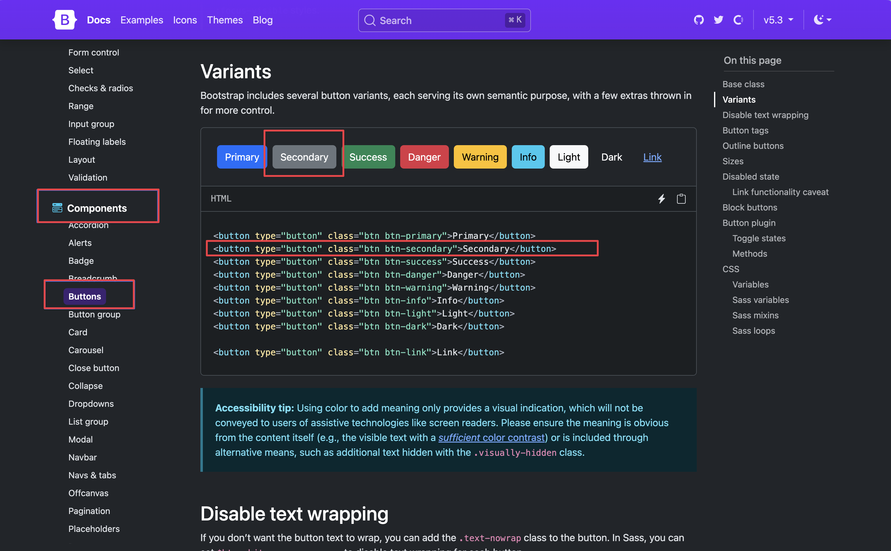
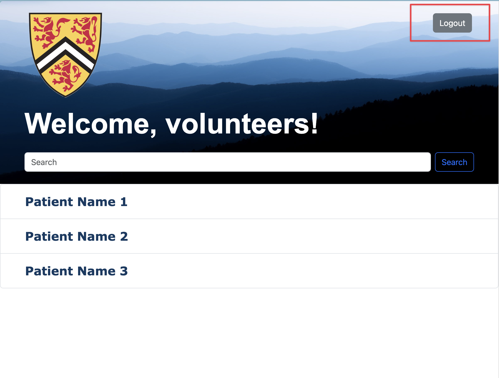
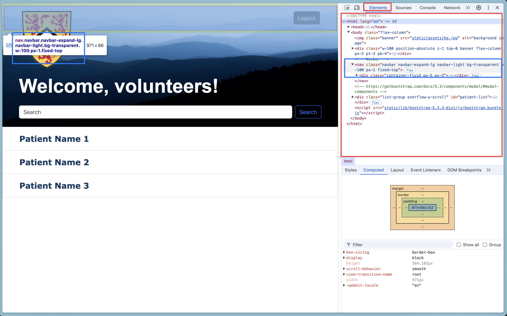
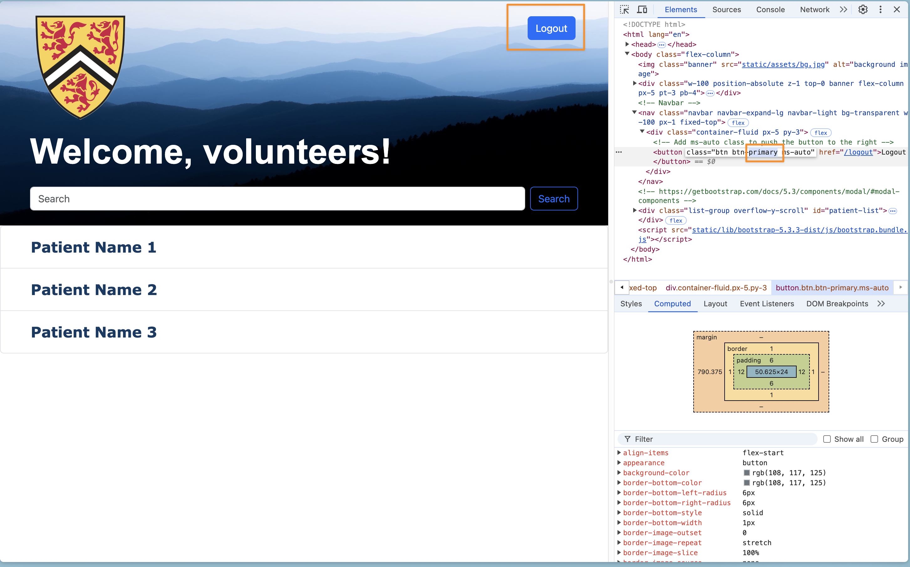
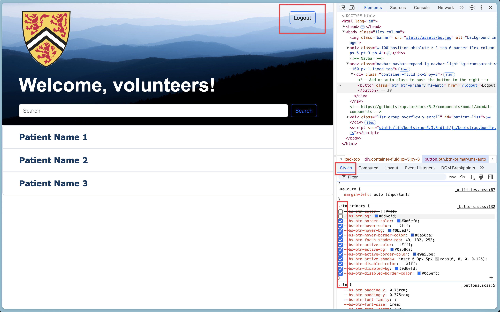
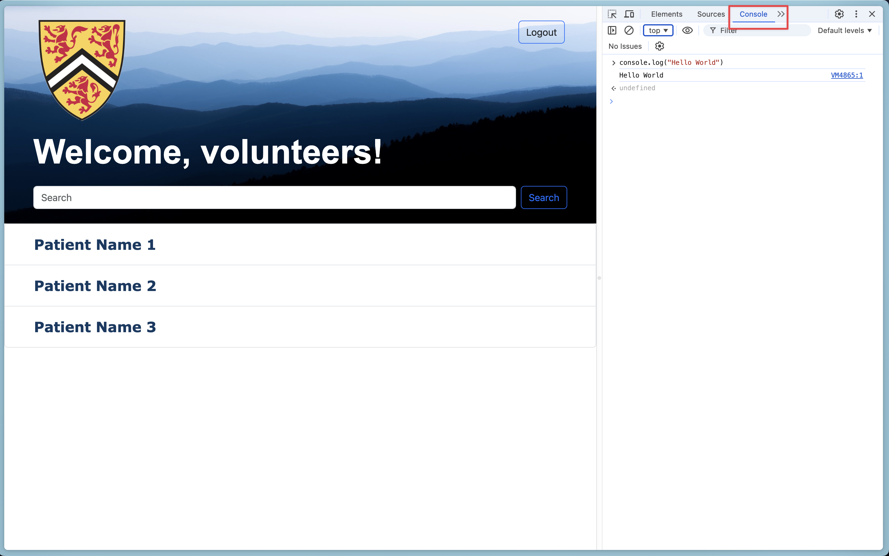
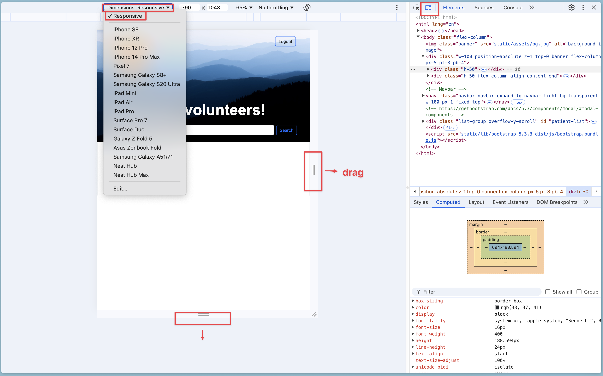

# Web Development: Beginnner's Guide

**Things to note before we start:**
- Among the ocean of tools available for web development, this guide aims to teach the basic of basics, using a select set of tools:
    - Front-End: HTML, CSS, and Bootstrap
    - Back-End: The Flask framework
    - Database: SQLite
- Code examples for a simple web application are provided alongside this guide to support your learning journey. By the end, you should have a basic understanding of how these examples were written and be ready to create your own basic web application.

- Let's get started!

## Table of Contents

### 1: [Web Development Core Components](#h1)

- 1.1: [**Front-End** Responsibilities](#h1.1)
- 1.2: [**Back-End** Responsibilities](#h1.2)
- 1.3: [**Database** Responsibilites](#h1.3)
- 1.4: [How they **work together**](#h1.4)

### 2: [Front-End Examples](#h2)

- 2.1: [Examples Webpages](#h2.1)
- 2.2: [Using Bootstrap](#h2.2)
- 2.3: [General Tips](#h2.3)
- 2.4: [Using the developer's tool (DevTool)](#h2.4)

### 3: [Back-End Development Guide](#h3)
- 3.1: [Setting Up the Flask Application](#h3.1)
- 3.2: [Main Routes and Views](#h3.2)
- 3.2: [Login and Signup Functionality](#h3.3)
- 3.3: [Updating HTML Templates](#h3.4)

### 4: [Database Development Guide](#h4)

### 5: [Running it All](#h5)

<h2 id=h1>Web Development Core Component</h2>

Web applications rely on three main parts: the Front End, Back End, and Database. Each part plays a unique role and they work together to provide a smooth user experience.

<h3 id=h1.1>Front-End Responsibilities</h3>

- Displaying information to the user
- Capturing user input through forms or buttons
- Sending requests to the back end and handling responses from it

<h3 id=h1.2>Back-End Responsibilities</h3>

- Processing and handling requests from the front end
- Executing application logic (e.g., calculations, data processing)
- Communicating with the database to store and retrieve data
- Sending responses back to the front end

<h3 id=h1.3>Database Responsibilities</h3>

- Storing data persistently
- Managing data through CRUD operations (Create, Read, Update, Delete)
- Ensuring data integrity and availability

<h3 id=h1.4>How They Work Together</h3>

here is a logic flow of how these three components interact:

1. **User Interaction at Front End:** A user interacts with a form on the website to create an account.
2. **Request to the Back End:** The front end sends this information (e.g., username and password) to the back end through an HTTP request.
3. **Back-End Processing:** The back end receives the request, processes the data, checks for any necessary validations, and prepares it for storage.
4. **Database Interaction:** The back end communicates with the database to store the new user information.
5. **Response to the Front End:** Once the data is successfully stored, the back end sends a response back to the front end, confirming the account creation.
6. **Displaying to the User at the Front End:** The front end receives the confirmation message from the back end and displays it to the user, letting them know their account was created successfully.

<h2 id=h2>Front-End Examples</h2>

- Front-end development typically uses a combination of HTML, CSS, and JavaScript.
- HTML structures the content, CSS styles the appearance, and JavaScript adds interactivity and dynamic behavior to the webpage.
- Frameworks and libraries like React, Vue.js, and Bootstrap are commonly used to streamline development, enhance functionality, and ensure responsive design for various devices.

<h3 id=h2.1> Example Webpages </h3>

- In this guide, very basic examples on using HTML, CSS, and Bootstrap will be provided to aide you.

- You should find in the `/Front-End` directory four html files. These are given to you as example webpages developed with incrementally completeness.

- The [`home.html`](Front-End/home.html) and [`login.html`](Front-End/home.html) are barebone html files with no stylings implemened.

  - They illustrate the essential structure and minimal content required to create a web page front-end using only HTML elements.

- the [`signup.html`](Front-End/signup.html) uses a [CSS file](static/assets/style_signup.css) to style its contents.

  - This is to demonstrate how CSS enhances the visual presentation by adding styles such as changing the color of a button when hovered over, making the page more visually appealing and interactive

- the [`view_patient.html`](Front-End/view_patients.html) uses both a [CSS file](static/assets/style_view_patients.css) autilizes both a CSS file and the **Bootstrap** framework for its design.
  - This demonstrates how Bootstrap's extensive library of prebuilt components, utilities, and layout options simplifies development, allowing for the creation of visually appealing pages with minimal custom CSS. Additionally, CSS can be used alongside Bootstrap to override default styles and introduce custom designs for a unique look.

<h3 id=h2.2>Using Bootstrap</h3>

- The [official Bootstrap documentation](https://getbootstrap.com/docs/5.3/getting-started/introduction/) is an excellent resource for learning how to use their library effectively. If you choose to use Bootstrap to enhance your front-end, referring to their documentation regularly is highly recommended!
- To give you an idea of how I used the Bootstrap template to make the front-end for the view_patient page, here is my workflow:

  1. I decided that I wanted a "logout" button to put into the navigation bar of my web page
  2. I went to their offical documentation to look for a template for making a button
  3. I found the page for `button` under `components` in their documentations. This page showcased a variety of buttons with different configurations and styles.
     
  4. I chose to use the gray button shown in the image above.
  5. I added the corresponding HTML code for the gray button into my [`view_patient.html`](Front-End/view_patients.html) file under the navbar, and added the `ms-auto` class to make it appear at the right. (the navbar is built using a Bootstrap template)

     ```html
     <!-- Navbar -->
     <nav
       class="navbar navbar-expand-lg navbar-light bg-transparent w-100 px-1 fixed-top"
     >
       <div class="container-fluid px-5 py-3">
         <!-- Add ms-auto class to push the button to the right -->
         <button class="btn btn-secondary ms-auto" href="/logout">
           Logout
         </button>
       </div>
     </nav>
     ```

  6. I rendered my webpage to check if it worked, and yes, it did!
     

<h3 id=h2.3>General Tips</h3>

**Start with Planning and Wireframing**

- Before you begin designing, have a clear concept of what the webpag should do, the user needs, and the overall goals.
- Create low-fidelity sketches or wireframes to outline the structure and layout of your page. I encourage you to ues [Figma](https://www.figma.com) to plannout the pages before you start coding.

**Learn HTML & CSS**

- There are tones of resources online for how to use HTML and CSS so my first advice to you is to use google and chatgpt well.
  - I would recommand the [HTML](https://www.w3schools.com/html/html_intro.asp) and [CSS tutorials](https://www.w3schools.com/css/css_syntax.asp) made by W3Schools if you are looking for a place to start.

**Referencing CSS Files in HTML**

- Link to external style sheet:
  - It’s best practice to keep your CSS in a separate file for maintainability and scalability. You can link it to your HTML file using the `<link>`tag inside the `<head>` section of your HTML document:
    ```html
    <link rel="stylesheet" href="path/to/styles.css" />
    ```
- Ordering of CSS files
  - The order of how you link the CSS files in the HTML file matters bacause the last linked file will take precedence if there are conflicting rules.

**Inline CSS Styling in HTML**

- Beside making a CSS class, you can apply styles directly within an HTML element using the `style` attribute:

  ```html
  <!-- Eample: line 12 in signup.html -->
  <h1 class="title-font" style="color:#007CB0">Sign Up</h1>
  ```

  - In this example, the `<h1>` heading element is styled using the `title-font` class defined in [external css file](static/assets/style_signup.css). The inline styling attribute, `style="color:#007CB0"` overwrites the text colour and set it to `#007CB0`

- This is useful for quick styling but should be used carefully since it can make your code harder to maintain.

**Referecing JavaScript Files in HTML**

- For complex scripts, you would want to keep your JavaScript in a separate file and link it to your HTML using the `<script>` tag.
  ```html
  <script src="path/to/script.js"></script>
  ```
- You can also use the `defer` or `async` attributes to improve page load speed. `defer` ensures the script is executed only after the HTML is fully parsed.
  ```html
  <script src="path/to/script.js" defer></script>
  ```

<h3 id=h2.4>Using the developer's tool (DevTool)</h3>

- DevTools is available in all modern web browsers. It allows you to inspect, debug, and modify HTML, CSS, and JavaScript in real-time.
  - I'm using [`Arc`](https://arc.net/) as my browser so I'll demonstrate with it, but the core of the DevTool is the same accross all browsers.
- In most browsers, you can open DevTools by right-clicking on any webpage element and selecting "Inspect" or pressing `Ctrl+Shift+I` (Windows/Linux) or `Cmd+Opt+I` (Mac).
- We will cover only the most basic functionalities of DevTools here. Feel free to explore further on your own if you’re interested in discovering more!

**Elements Panel**

- This panel (in red) shows the structure of your HTML document. You can inspect the elements on your web page by hovering your cursor on them (in blue)
  

- **Editing HTML**: Double click on any element to edit its HTML directly in the browser:

  

  - by changing the class name from `btn-secondary` to `btn-primary` here, I changed the button's colour from grey to blue. (These are Bootstrap classes).

- **Editing CSS**: The style panel displays the applied styles for the selected element. You can modify styles, add new ones, or toggle them on and off to see how they affect the page.
  

**Console Panel**

- The Console lets you interact with JavaScript in real-time. You can type and execute JavaScript code directly here for testing and debugging.
- The errors, warnings, and console.log() outputs appear here
  

**Device Toolbar**

- Click the device icon (or press `Ctrl+Shift+M` on Windows/Linux or `Cmd+Opt+M` on Mac) to simulate different screen sizes and test responsiveness.
  

<h2 id=h3>Back-End Development Guide</h2>

- Now that you have learnt about the front end, this part of the guide will walk you through the back-end structure.
- There are many frameworks for back-end, such as Node.js with Javascript, Flask and Django with Python, Ruby on Rails with Ruby, etc.

- For this guide, we will walk through Python's **Flask** framework by focusing on the key Python files:

  - [`app.py`](Full-Stack/app.py): setting up the flask application with some boilerplate code
  - [`run.py`](Full-Stack/run.py): a helper file to run the application for the first time
  - [`main.py`](Full-Stack/main.py): where the real magic (front-end routing, communicating with the database) happens. We will focus on this file the most. 

- Flask provides a way to build a small web application quickly with one Python file. However, a small application can grow into a large application with multiple database tables, hundreds of routes, and complex features. Writing the code for a large application in one file will quickly become messy and hard to manage. Flask allows you to [organize your application’s code base](https://www.digitalocean.com/community/tutorials/how-to-structure-a-large-flask-application-with-flask-blueprints-and-flask-sqlalchemy) by splitting each of the application’s major parts into specific directories and files for a better-organized application.

- We will also explain the login and signup functionalities, how to update HTML templates to reference Python functions, and the steps to run the application.

<h3 id=h3.1>Setting Up the Flask Application</h3>

[`app.py`](Full-Stack/app.py)

- **Purpose**: Creates and configures the Flask application.

- **Key Configurations**:

    - **SECRET_KEY**: Used for session management and security.
    - **SQLALCHEMY_DATABASE_URI**: Database URI for SQLAlchemy.
    - **DEBUG**: Enables or disables debug mode.
    - **SQLAlchemy**: Initializes the database.
    - **Flask-Login**: Manages user sessions.
    - **Blueprints Registered**:

**Main Blueprint**: Handles primary application routes (main).

```python
app = Flask(__name__)
app.config['SECRET_KEY'] = 'your-secret-key'
app.config['SQLALCHEMY_DATABASE_URI'] = 'sqlite:///app.db'
app.config['DEBUG'] = True
```

**Initializing extensions**:
Extensions are flask extensions used for different functionalities. Here, we use login_manager to help facilitate easy login and user management.

```python
db.init_app(app)
login_manager = LoginManager()
login_manager.login_view = 'main.login'
login_manager.init_app(app)
```

**Registering blueprints**:

Flask provides a feature called blueprints for making application components. For example, you can use blueprints to structure a large social media application with different blueprints, such as a users’ blueprint, a blueprint for posts, one for followers, and so on for each feature.

```python
from main import main as main_blueprint
app.register_blueprint(main_blueprint)
```

[`run.py`](Full-Stack/run.py)

**Purpose**: Entry point to run the Flask application.

**Instructions**:

- Imports the create_app function from app.py.
- Creates the Flask application instance.
- Provides instructions for running the application.

<h3 id=h3.2>Main Routes and Views</h3>

**What is Routing**

- Routing determining how an application responds to a client request at the front-end. 
- In a web framework like Flask, routing connects **URLs** to **functions in the application**, allowing different web pages or API responses to be generated based on the route specified. 
- For example, when you click the **signup** button, you would expect that your browser will jump to a **signup** page; when you enter your login information in the textbox of the signup page, you would expect that thoese information are "seen" and "remembered" by the server. These expectations are handled by the backend:
    

    - For example in this code:
        ```html
        <p>No account? <button type="submit" onclick="window.location.href='{{ url_for('main.signup') }}'">Signup</button></p>
        ```

    - "Clicking the `**signup**` button" is a form of user request. Browser "jumping to an other url" is the backend's response to the request.

[`main.py`](Full-Stack/main.py)

In a social media application, you might have the routes for users in a file called routes.py inside a directory called users, and you might then collect the database models for users inside a module called users.py inside a models directory. Then you can do the same for posts, followers, hashtags, questions, answers, ads, the marketplace, payments, and other features in your large social media application. If you want to edit some business logic into the payments code, you can change the database code for payments in a file located at `mysocialapp/models/payment.py`, then change the business logic in a file located at `mysocialapp/payments/routes.py`
Here for simplicity we just have one `main.py` file.

In our routes when we call `/route` we are refering to our `website/route` page on our url. These are called **routes**.

- **Purpose**: Contains the primary routes for the application.

- **Routes Defined**:

  - Index Route (/):

  - Renders the homepage (home.html).

```python
@main.route('/')
def index():
    return render_template('home.html')
```

**Login Routes**:

- **GET** `/login`: Renders the login page (login.html). **GET** is simply an http request that means to retreive some data. In this case we are retreiving the `login.html` page

```python
@main.route('/login')
def login():
    return render_template('login.html')
```


- **POST** `/login`: Processes login form submission.


  - In the `login.html` file we can see that the login form is a 'POST' request. This is how the front-end of the login page signals to the backend that it wants to send some data. The data it is sending here are login details which the backend will then validate if it is correct.

    `login.html`
    ```html
    <form action="/login" method="post">
    ```

Here we can see in our backend we are going to the login route and listening to a POST request.

```python
@main.route('/login', methods=['POST'])
def login_post():
    # Handle login logic
```

**Signup Routes**:

- **GET** `/signup`: Renders the signup page (signup.html).


```python
@main.route('/signup')
def signup():
    return render_template('signup.html')
```


- **POST** 
    - `/signup`: Processes signup form submission.
    - Similar to our login post. The signup post html is also a `POST` form which means it wants to add data to the `/signup` backend route.
       ```html
       <form method="POST" action="/signup">
        ```  
    - Our sign-up backend is listening for that post request which is just a form with the signup details and will perform some action accordingly. Which in this case is creating a new user in the database (to be covered later).


```python
@main.route('/signup', methods=['POST'])
def signup_post():
    # Handle signup logic
```

**Logout Route** (`/logout`):

- Logs out the user and redirects to the index page.
- Requires the user to be logged in (@login_required).

```python
@main.route('/logout')
@login_required
def logout():
    logout_user()
    return redirect(url_for('main.index'))
```

**View Patients Route** (`/view_patients`):

- Renders the patients' view page (`view_patients.html`).

```python
@main.route('/view_patients', methods=['GET'])
def view_patients():
    return render_template('view_patients.html')
```

<h3 id=h3.3>Login and Signup Functionality</h3>

**Login Process**

- **File**: `main.py`
- **Function**:` login_post()`
- **Purpose**: Handles login form submission.
- **Process**:
  1. **Retrieve Form Data**:
     - Email, password, and remember me option.
  2. **User Validation**:
     - Query the database for the user by email.
     - Use `check_password_hash` to verify the password.
  3. **Authentication**:
     - If valid, log in the user using `login_user`.
     - If invalid, flash an error message and redirect to login page.
  4. **Redirection**:
     - Redirect to the index page upon successful login.

**_Signup Process_**

- **File**: `main.py`
- **Function**: `signup_post()`
- **Purpose**: Handles signup form submission.
- **Process**:
  1. **Retrieve Form Data**:
     - Name, email, and password.
  2. **User Existence Check**:
     - Query the database to check if the email already exists.
     - If it exists, flash a message and redirect to signup page.
  3. **User Creation**:
     - If the email is new, create a User instance.
     - Hash the password using `generate_password_hash`
     - Add the new user to the database session.
     - Commit the session to save the user.
  4. **Redirection**:
     - Redirect to the login page upon successful signup.

<h3 id=h3.4>Updating HTML Templates</h3>

Referencing Python Functions in `home.html`

- **Purpose**: Update hyperlinks to use Flask's url_for function, which dynamically generates URLs for routes.
- **Steps**:

  1. Identify the HTML Templates:

     - Find the `home.html` file in the templates directory.

  2. Update href Attributes:

     - Replace hardcoded URLs with `url_for` references

  3. Examples:

```html
<!-- Before -->
<a href="/login">Login</a>
<a href="/signup">Signup</a>

<!-- After (where "main." is the python blueprint with the login function) -->
<a href="{{ url_for('main.login') }}">Login</a>
<a href="{{ url_for('main.signup') }}">Signup</a>
```

<h2 id=h4>Database</h2>

<h3>Defining Models with SQLAlchemy</h3>

[`models.py`](Full-Stack/models.py)

- **Purpose**: Defines the database models using SQLAlchemy.

- **Models Defined**:

  - **User Model**: Represents users of the application.

- **Key Components of User Model:**

- **Fields**:
  1. id: Primary key.
  2. name: User's name.
  3. email: User's email (unique).
  4. password: Hashed password.
- **Inheritance:**
  1. Inherits from `UserMixin` for Flask-Login support.
  2. Inherits from `db.Model` for SQLAlchemy integration.

[`run.py`](Full-Stack/run.py)

Add this code snippet to create the database based on your models after create app:

```python
with app.app_context():
    db.create_all()
```

<h2 id=h5>Running the Application</h2>

**Setting the `FLASK_APP` Environment Variable.**
(_Note replace app.py with your path to app.py_)

Flask will automatically detect the create_app() factory function in your app package and use it to create an application instance. But you’ll need to set the environment variables required to run your Flask application in development mode first.

- **For macOS and Linux:**

  - Open your terminal and run: `export FLASK_APP=app.py`

- **For Windows Command Prompt:**
  - Open PowerShell and run: `set FLASK_APP=app.py`

**Running the Application with Flask**


```shell
flask run
```

Notes:

Ensure you are in the directory where run.py is located.
The application will start running on http://127.0.0.1:5000
If you have set DEBUG = True in app.py, the server will auto-reload on code changes.
